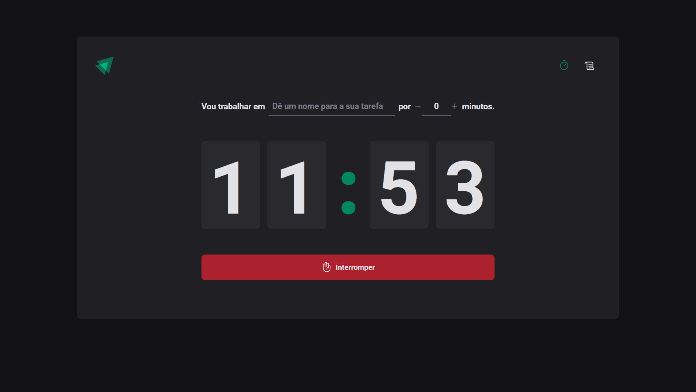
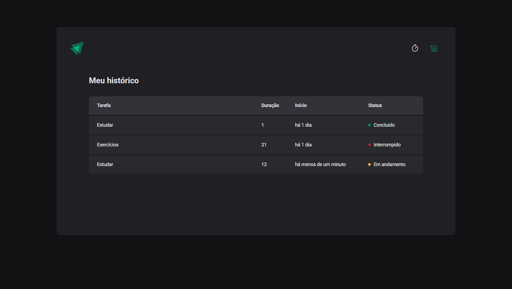

<h1 align="center">
  
</h1>

<p align="center">
  <a href="#como-executar">ℹ️ Como Executar?</a>&nbsp;&nbsp;&nbsp;|&nbsp;&nbsp;&nbsp;
  <a href="#tecnologias">🚀 Tecnologias</a>&nbsp;&nbsp;&nbsp;|&nbsp;&nbsp;&nbsp;
  <a href="#autores">💻 Autores</a>&nbsp;&nbsp;&nbsp;|&nbsp;&nbsp;&nbsp;
  <a href="#licenca">📝 Licença</a>
</p>

<p align="center">
  O <b>Ignite Time</b> é o segundo projeto do curso Ignite ReactJS da Rocketseat. Consiste em criar uma aplicação de timer para criar uma tarefa e definir um tempo para ela (baseada no pomodoro) e possui junto uma página de histórico para acompanhamento.
</p>

---

<div align="center">
  
  
</div>

---

<h2 id="como-executar">ℹ️ Como Executar?</h2>

> **1.0.** Clone o Repositório:

```bash
https://github.com/matheusfalavigna/ignite-reactjs.git
```

> **1.1.** Acesse a pasta do projeto:

```bash
cd ignite-reactjs
```

> **1.2.** Acesse a pasta do Ignite Timer:

```bash
cd 02-ignite-timer
```

> **1.3.** Instale as dependências:

```bash
pnpm install
```

> **1.4.** Inicie o Serviço:

```bash
pnpm dev
```

> ➡️ Acesse [http://localhost:5173/](http://localhost:5173/) para acessar a aplicação web.

<h2 id="tecnologias">🚀 Tecnologias</h2>

- [TypeScript](https://www.typescriptlang.org/)
- [React](https://pt-br.reactjs.org/)
- [Vite](https://vitejs.dev/)
- [Phosphor Icons](https://phosphoricons.com/)
- [React Hook Form](https://react-hook-form.com/)
- [date-fns](https://date-fns.org/)
- [ESLint](https://eslint.org/)
- [Zod](https://zod.dev/)
- [styled-components](https://styled-components.com/)
- [Immer](https://immerjs.github.io/immer/)

<h2 id="autores">💻 Autores</h2>

<table>
  <tr>
    <td align="center">
      <a href="http://github.com/matheusfalavigna/">
        
        <br />
        <sub>
          <b>Matheus Falavigna</b>
        </sub>
       </a>
       <br />
       <a href="https://www.linkedin.com/in/matheusfalavigna/" title="Linkedin">@matheusfalavigna</a>
       <br />
       <a href="http://github.com/matheusfalavigna/" title="Code">💻</a>
    </td>
    <td align="center">
      <a href="http://github.com/rocketseat/">
        
        <br />
        <sub>
          <b>Rocketseat</b>
        </sub>
       </a>
       <br />
       <a href="http://github.com/rocketseat/" title="Linkedin">@rocketseat</a>
       <br />
       <a href="https://www.rocketseat.com.br/" title="Education Platform">🚀</a>
    </td>
  </tr>
</table>

<h2 id="licenca">📝 Licença</h2>

Este projeto está licenciado sob a licença MIT - veja o arquivo de [licença](https://github.com/matheusfalavigna/ignite-reactjs/blob/main/LICENSE) para mais detalhes.
