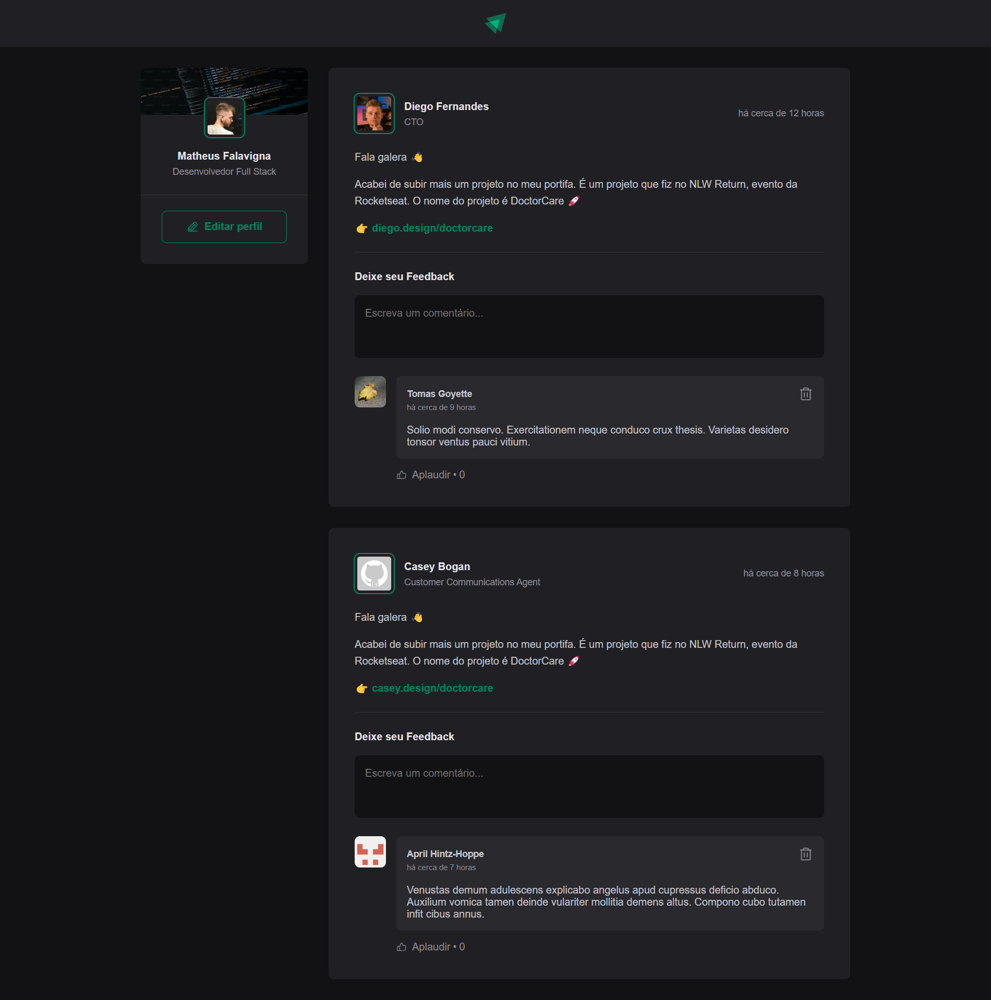

   

> Repositório onde se encontra todos os projetos desenvolvidos na trilha de **ReactJS do Ignite** da [Rocketseat](https://github.com/Rocketseat).

<h1>📌 Conteúdo</h1>

- [Projetos](#projetos)
  - [Chapter I](#chapter-i)
    - [Ignite Feed (JavaScript)](#ignite-feed)
    - [Ignite Feed (TypeScript)](#ignite-feed-em-typescript)
- [Autores](#autores)
- [Licença](#licenca)

<h1 id="projetos">🚀 Projetos</h1>

<h2 id="chapter-i">Chapter I</h2>

<h3 id="ignite-feed">Ignite Feed (JavaScript)</h3>

  

<h3 id="ignite-feed-em-typescript">Ignite Feed (TypeScript)</h3>

  

<h2 id="autores">💻 Autores</h2>

<table>
  <tr>
    <td align="center">
      <a href="http://github.com/matheusfalavigna/">
        
         
        
          <b>Matheus Falavigna</b>
        
       </a>
        
       <a href="https://www.linkedin.com/in/matheusfalavigna/" title="Linkedin">@matheusfalavigna</a>
        
       <a href="http://github.com/matheusfalavigna/" title="Code">💻</a>
    </td>
    <td align="center">
      <a href="http://github.com/rocketseat/">
        
         
        
          <b>Rocketseat</b>
        
       </a>
        
       <a href="http://github.com/rocketseat/" title="Linkedin">@rocketseat</a>
        
       <a href="https://www.rocketseat.com.br/" title="Education Platform">🚀</a>
    </td>
  </tr>
</table>

<h2 id="licenca">📝 Licença</h2>

Este projeto está licenciado sob a licença MIT - veja o arquivo de [licença](https://github.com/matheusfalavigna/ignite-reactjs/blob/main/LICENSE) para mais detalhes.
